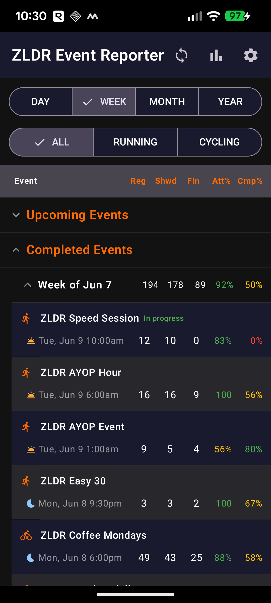
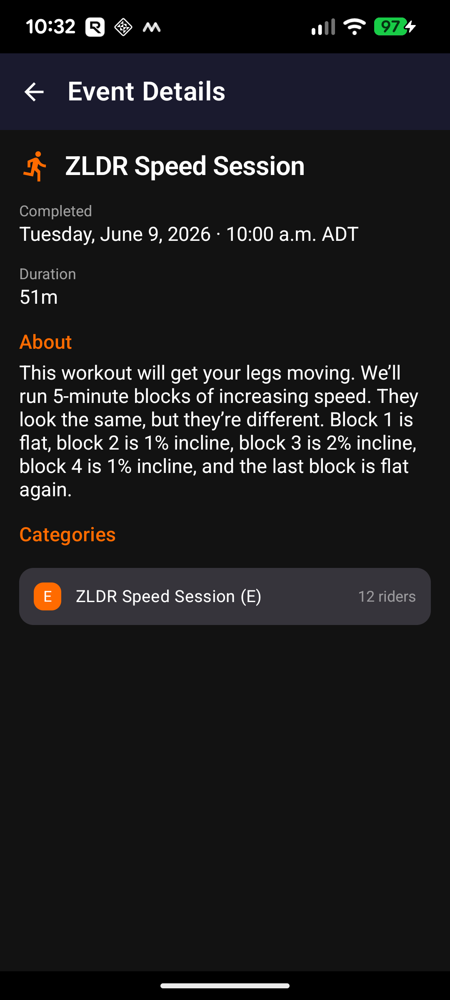
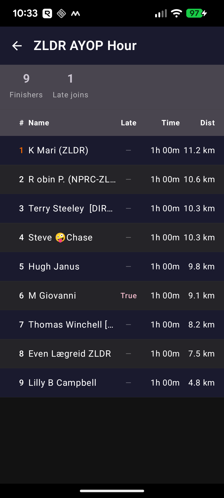
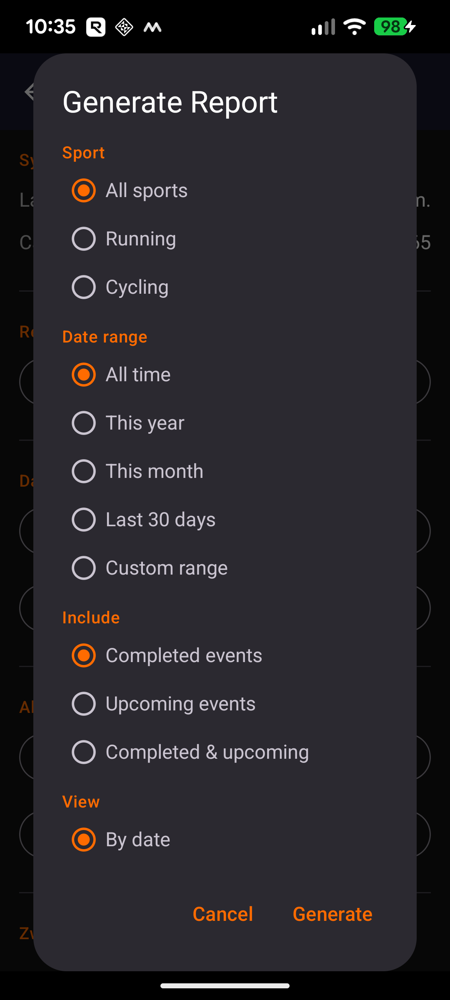

# ZLDR Event Reporter

An Android and PWA (Progressive web) app for the ZLDR (Zwift Long Distance Runners and Riders) community for tracking club event statistics — sign-ups, attendance, and finishers.

## Features

**ZLDR Event Reporter** is the easiest way to stay on top of every ZLDR running and cycling event. Sign in once with your Zwift account and the app takes care of everything — automatically discovering upcoming events and pulling in real attendance figures as they happen, so the numbers are always there when you need them.

- **Live event dashboard** — browse upcoming and completed events by day, week, month, or year, or switch to Series view to see how each recurring series is trending over time. Registered, Showed Up, Finished, and attendance rate columns tell the whole story at a glance.
- **Event & participant detail** — tap any event for full details (route, duration, category breakdown), or double-tap to see the ranked finisher list with times and distances.
- **In-progress tracking** — sign-up counts refresh automatically while an event is live, so you can watch the numbers build in real time.
- **Shareable reports** — generate a report filtered by sport, date range, and view, then share it as CSV, plain text, HTML, or PDF with a couple of taps.

  
  &nbsp;
  
  &nbsp;
  
  &nbsp;
  

---

## Web App (PWA)

A Progressive Web App version is available at **https://zldr-event-reporter.fly.dev** — no download or installation required. It works on any device with a modern browser, including:

- iOS (Safari)
- Android (Chrome)
- Windows (Chrome, Edge, or any browser)
- macOS (Safari, Chrome, or any browser)
- Any other platform with a modern browser

### Install on Android (Chrome)

Chrome does not automatically show an install prompt. To add the app to your home screen:

1. Open **https://zldr-event-reporter.fly.dev** in Chrome
2. Tap the **⋮** menu (three dots, top right)
3. Tap **"Add to Home screen"**

After installing, the app launches in standalone mode — no browser address bar — from an icon on your home screen, exactly like a native app.

### Install on iOS (Safari)

Safari does not automatically show an install prompt. To add the app to your home screen:

1. Open **https://zldr-event-reporter.fly.dev** in Safari
2. Tap the **Share** button (box with arrow, bottom of screen)
3. Tap **"Add to Home Screen"**

After installing, the app launches in standalone mode — no browser address bar — from an icon on your home screen, exactly like a native app.

---

## Android App Download

Go to the [Releases](../../releases) page to download the latest APK.

> **Install note:** You will need to allow installation from unknown sources on your Android device. Go to **Settings → Apps → Special app access → Install unknown apps** and enable it for your browser or file manager.

## User Guide

- [User Guide (HTML)](https://victorypoint.github.io/ZLDREventReporter/docs/userguide.html)
- [User Guide (PDF)](https://github.com/victorypoint/ZLDREventReporter/blob/master/docs/userguide.pdf)

## Requirements

**Web app:** Any modern browser (Chrome, Safari, Edge, Firefox). A Zwift account.

**Android app:** Android 8.0 (Oreo) or higher. A Zwift account.
